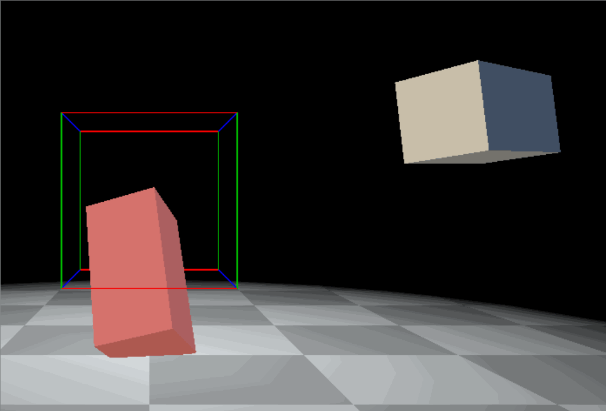

# Final Project: Temperature Diffusion for GP class (2023 Spring)

We implement a simulator for **2D Temporal Diffusion**. 

The project includes explicit method and implicit method. Also, you can control the amount of heat sources.

## Ex3: Flip Water Exercise for GP class (2023 Spring)

### Notes

Due to the significant stime taken up by paper submissions and graduation thesis, there is a tight schedule, and as a result, some bugs remain unresolved.

### Functions

The physical simulation of the fluid model has been completed, utilizing the PIC (Particle-in-Cell) method and FLIP (Fluid Implicit Particle) method.

However, the issue regarding how to transition between the Lagrangian method and the Eulerian method has not been resolved. (in the function `FlipSimulator::transferVelocities`) As a result, the final outcome appears to have only considered the effect of gravity and collision.

And I will still tring my best to solve the above problems. I apologize for any inconvenience caused.

## Ex2: Rigid Body Exercise for GP class (2023 Spring)

### Functions

We implement a simulator for **3D rigid body systems**. 

The project contains four demos with mouse interaction to simulate different rigid-body systems. The samples in the project are simulated with **Explicit Euler** method.

### Demo 1: A simple one-step test

We manually calculate the solution to the single rigid box setup, with the parameters given in the homework requirements, for an Euler time step of size h=2.

### Demo 2: Simple single body simulation


In this demo, we simulate the single rigid body with smaller time step h = 0.01, for multiple steps. 

Mouse interaction is allowed in this circumstance. You can add an extra force by draging the mouse and choose the point of the force by the slider bars.

### Demo 3: Two-rigid-body collision scene

In this demo, we set up our own scene with two rigid body boxes, and their initial linear velocities make them collide. Our demo showes the two body colliding, and separating after collision. (See the teaser gif)

### Demo 4: Complex simulation


In this demo, we set up a scene with 6 rigid boxes and allow mouse interaction. Dragging the green rigid body to apply a force on it and see the collision process between those rigid bodies.

---
<font size="2"> Thanks to hinczhang's code structure. It really takes me long to read the source code of several libraries. His code structure is clear and helps me a lot to understand the logic of the angular process. </font>

We set the direction of the gravity along y-axis and the ground plain is `y=-1`.

### Template Readme

``` txt
Developing Log: 
Visual Studio 2013/15/17 Template Project for C++/DirectX11 Application
Marc Treib, Florian Ferstl, Sept 2013 
Updated: Florian Ferstl, Sept 2014 
Updated: Mina Saad Aziz, May 2016 
Updated: Mengyu Chu, Nov 2017    
Updated: You Xie, Nov 2019
```

This solution contains the following components:

 - AntTweakBar 1.16 
   "AntTweakBar is a small and easy-to-use C/C++ library that allows program-
   mers to quickly add a light and intuitive graphical user interface into 
   graphic applications based on OpenGL (compatibility and core profiles), 
   DirectX 9, DirectX 10 or DirectX 11 to interactively tweak parameters 
   on-screen."
   Homepage: http://anttweakbar.sourceforge.net/

 - DirectX Tool Kit, version "September 22, 2017" 
   (the 'MakeSpriteFont' project is part of the DirectXTK)
   "The DirectX Tool Kit (aka DirectXTK) is a collection of helper classes for
   writing Direct3D 11 code in C++."
   Homepage: https://github.com/Microsoft/DirectXTK
 
 - DXUT, version "March 10, 2017 (11.15)"
   "DXUT is a "GLUT"-like framework for Direct3D 11.x Win32 desktop 
   applications; primarily samples, demos, and prototypes."
   Homepage: https://github.com/Microsoft/DXUT

 - Effects 11 (FX11), version "March 10, 2017 (11.19)"
   Homepage: https://github.com/Microsoft/FX11

 - Main Project, Simulations:
   > "main.cpp": Structured like a typical DXUT-based application. It contains
     example code that correctly integrates and demonstrates how to use 
	 AntTweakBar (for a simple GUI) and DirectXTK (for simple, "fixed-function"
	 rendering of common primitives).
   > "effect.fx": Starting point for custom shaders, already loaded in 
     main.cpp. If  you don't need custom shaders, you can safely ignore or even
	 delete it (and any code related to "g_pEffect" in main.cpp)
	 
Further Note:

 - DirectXMath (all functions/types starting with XM*): DirectXTK and the new 
   DXUT are both based on the new DirectXMath API for linear algebra that comes
   with the Windows 8.* SDKs (replacing the old D3DXMath). You can use it for
   all of your linear algebra tasks.
   Documentation: https://msdn.microsoft.com/en-us/library/windows/desktop/hh437833(v=vs.85).aspx
